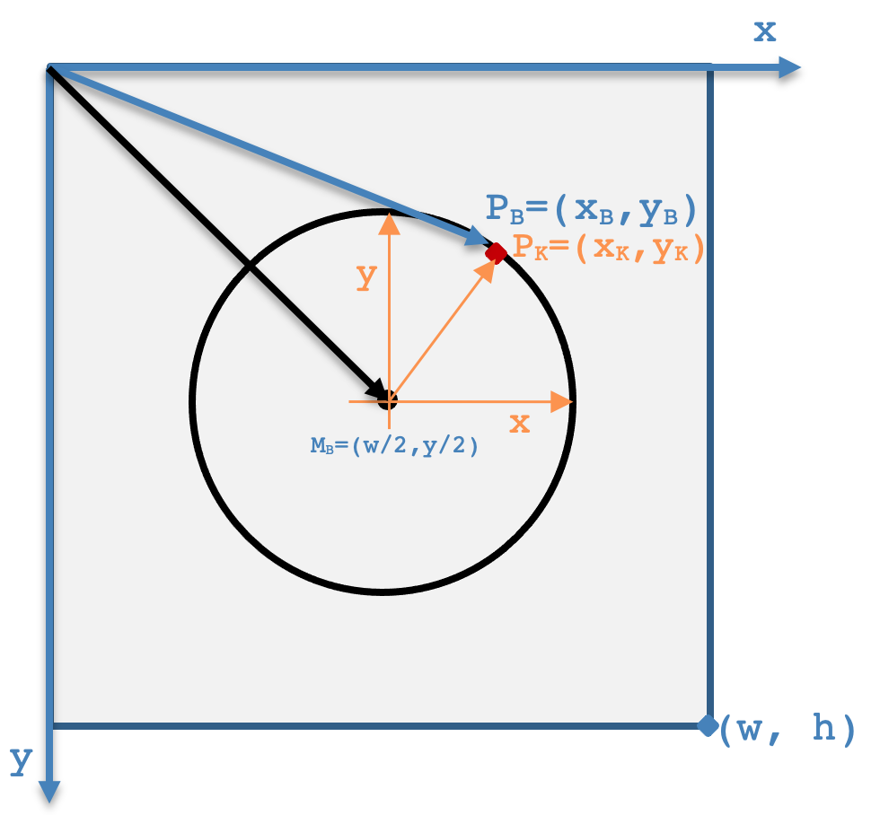

<!--- Technische Informatik (FK04)"
Author: Benjamin Kormann			Date: <2022 Oct 03> 
Changes by:
<NAME> - <JJJJ MMM DD> - <comment> 

--->
  

**TI3-Embedded Systems: Versuch 01**

2023 Sommersemester | V 1.4 | Prof. Dr. Benjamin Kormann

***
# Zielsetzung: Bitmap-Bilder mit Kreisen erzeugen

Das Ziel des ersten Praktikumsversuchs ist es, ein Programm zu schreiben, das quadratische Graustufen-Bitmap-Bilder mit Kreisen erzeugt. Die Bildgröße, die Anzahl der Kreise und der Dateiname sollen über Benutzereingaben einstellbar sein. 

Die folgenden beiden Abbildungen zeigen Beispielbilder von 200x200 Pixel mit 4 konzentrischen Kreisen und 300x300 Pixel mit 7 konzentrischen Kreisen:

<p float="left">
  
   
</p>

## Allgemeine Hinweise

Bevor Sie mit der Bearbeitung dieses Versuchs starten lesen Sie bitte die allgemeinen Hinweise auf der ersten Seite genau durch.

### Informationen zum Präsenzpraktikum

Sie haben Ihre eigenen Rechner mit der virtuellen Maschine eingerichtet, um Beispiele aus der Vorlesung auch zu Hause entwickeln können. Außerdem gibt Ihnen dieses Setup die Möglichkeit, mit der Bearbeitung der Praktikumsaufgaben bereits auf dem eigenen Rechner (virtuelle Maschine) zu beginnen. 

#### Vorbereitungen zu Hause

Es ist erforderlich, dass Sie den letzten Stand Ihrer Praktikumsaufgaben auch in GitLab hochgeladen haben. Stellen Sie dies nochmals sicher, indem Sie auf Ihrem privaten Rechner im Git Repository mit

```
git push
```

den aktuellen Stand ins GitLab übertragen. 

#### Vorbereitungen im Labor

Die Praktikumsaufgaben werden je nach Gruppeneinteilung in den Laboren E303 und E308 durchgeführt. Dazu werden Raspberry Pis eingesetzt. 

##### Besonderheiten im Labor E303

Suchen Sie sich einen Arbeitsplatz aus. An jedem Arbeitsplatz ist ein Raspberry Pi angeschlossen und per Netzwerk verfügbar. Eventuell müssen Sie die Stromversorgung noch am Raspberry Pi anschließen. Starten Sie den Desktop Rechner an Ihrem Arbeitsplatz und melden Sie sich unter Windows mit folgender Kennung an:

```
Benutzername: pi01
Passwort: raspi
```

Es handelt sich bei dieser Kennung um eine Praktikumskennung. Es sind auch noch weitere Kennungen pi01, pi02, ..., pi20 verfügbar. Nutzen Sie am besten die Kennung, die zu Ihrer Sitzplatznummer passt. Legen Sie demnach keine persönlichen Dokument unter diesem Account ab, sondern nutzen Sie diesen ausschließlich zur Bearbeitung der Praktikumsaufgabe.

Nach der Anmeldung können Sie sich mit dem Windows Programm VNCViewer mit dem Raspberry Pi verbinden. Starten Sie dazu den VNCViewer und tippen Sie die IP-Adresse des Raspberry Pis ein. Die IP-Adresse steht auf dem Gehäuse des Raspberry Pis. Nachdem die Verbindung zum Raspberry Pi hergestellt wurde melden Sie sich mit

```
Benutzername: pi
Passwort: rpiXX
```

an. Beim Passwort entspricht das XX der Nummer des Raspberry Pis (bspw. 36). Die Benutzername/Passwort Kombination ist sowohl für VNC als auch für die Anmeldung am Raspberry Pi erforderlich. Sie sind nun auf dem Raspberry angemeldet und können darin arbeiten wie in Ihrer eigenen virtuellen Maschine. 

##### Besonderheiten im Labor E308

Suchen Sie sich einen Arbeitsplatz aus. In dem Labor sind die Raspberry Pis an einem zentralen Ort verfügbar. Es ist nicht erforderlich, dass Sie sich einen Raspberry Pi direkt an den Arbeitsplatz stellen.

Starten Sie den Desktop Rechner an Ihrem Arbeitsplatz und melden Sie sich unter Windows mit folgender Kennung an:

```
Benutzername: pi
Passwort: raspi
```

Nach der Anmeldung können Sie sich mit dem Windows Programm VNCViewer mit einem Raspberry Pi verbinden. Bevor Sie sich mit einem Raspberry Pi verbinden, lassen Sie sich von dem Praktikumsbetreuer einen Raspberry Pi zuweisen. Sie erhalten einen Namen (bspw. `lmc-rpi36`) sowie eine zugehörige IP-Adresse (bspw. `172.22.206.75`). Starten Sie nun den VNCViewer und tippen Sie die IP-Adresse des Raspberry Pis ein. Nachdem die Verbindung zum Raspberry Pi hergestellt wurde melden Sie sich mit

```
Benutzername: pi
Passwort: rpiXX 
```

an. Beim Passwort entspricht das XX der Nummer des Raspberry Pis (bspw. 36). Die Benutzername/Passwort Kombination ist sowohl für VNC als auch für die Anmeldung am Raspberry Pi erforderlich. Sie sind nun auf dem Raspberry angemeldet und können darin arbeiten wie in Ihrer eigenen virtuellen Maschine. 

#### Umgebung zur Bearbeitung einrichten

Unabhängig vom Labor sind Sie nun erfolgreich auf einem Raspberry Pi angemeldet. Nun müssen Sie Ihre Quellen aus GitLab auf den Raspberry Pi laden. Dazu müssen sowohl die ssh Authentifizierung sowie die Git Konfiguration ausgeführt werden. Starten Sie das Terminal in der Symbolleiste und führen Sie die folgenden Kommandos aus:

```
cd
rm -rf .ssh
ssh-keygen -t rsa -b 2048
cat .ssh/id_rsa.pub
```

Kopieren Sie nun den öffentlichen Schlüssel in Ihr GitLab Profil. Dazu loggen Sie sich im Browser in https://gitlab.lrz.de mit Ihren Zugangsdaten ein und fügen den SSH Key hinzu. Diese Konfiguration haben Sie auch bereits auf Ihrem eigenen Rechner einmal durchgeführt.

Grundsätzlich können Sie nun bereits mit Git und GitLab arbeiten. Da die Raspberry Pis nicht personalisiert sind müssen Sie den Benutzernamen noch konfigurieren, sonst erscheint in den `commit` Nachrichten ein fremder Name. Dazu führen Sie im Terminal die folgenden Kommandos aus:

```
git config --global user.name "John Doe"
git config --global user.email jd@example.com
```

Anstatt John Doe verwenden Sie natürlich Ihren Namen und ebenso setzen Sie bei jd@example.com Ihre E-Mail Adresse ein. Nun können Sie den aktuellen Stand aus GitLab laden:

```
git clone git@......
```

Selbstverständlich müssen Sie sich nun die richtige `clone`-Adresse aus Ihrem GitLab Projekt kopieren und in das oben angegebene Kommando einsetzen.


### Verwendung von CI/CD

Für die Bearbeitung des Praktikumsversuchs wird Ihnen neben der Versionsverwaltung Git die sog. Continuous Integration (CI) Funktionalität von GitLab zur Verfügung gestellt. Diese bewirkt, dass Sie ihren entwickelten Softwarestand in Ihr eigenes Repository in GitLab pushen können und anschließend werden automatisiert Tests auf Ihren Quelltext ausgeführt. Darüber haben Sie die Möglichkeit, selbst festzustellen, ob Ihre Implementierung noch grundlegende Fehler enthält. Wichtig dabei zu wissen ist, dass erfolgreiche Tests noch keine Garantie dafür sind, dass Ihr Programm am Ende keine Fehler enthält. Aber es werden grundsätzliche Aspekte geprüft. Hierzu wird empfohlen, dass Sie in dem PDF-Dokument *Einführung in das Versionsverwaltungssystem Git und das LRZ GitLab* die Abschnitte 3.4.2 vollständig lesen.

### Abgabe des Versuchs

Jeder Praktikumsteilnehmer muss den eigenen Versuch beim jeweiligen Praktikumsbetreuer vorstellen und Fragen zu der Lösung beantworten. Dabei ist es auch wichtig, dass *Ihre eigene Lösung in Ihrem eigenen Git Repository in GitLab* (`git push`) vorhanden ist.

### Abnahmekriterien

Bei der Abgabe werden die Praktikumsbetreuer nicht nur auf die Funktionalität, sprich das zu erreichende Ergebnis achten. Die erfolgreiche Abgabe unterliegt den folgenden Kriterien:
1. **Aufgabenstellung** ist funktional **erfüllt**
2. Die **Testfälle** laufen alle **erfolgreich** durch
3. **Fragen** zur Lösung und zu Konzepten in C **müssen beantwortet werden**
4. Sie haben ausreichend (mehr als 4) **commit Nachrichten** in Git erstellt
5. Der Quelltext besitzt einen **Dokumentationsgrad** von **mindestens 25 %** (Der Dokumentationsgrad bestimmt sich aus der Anzahl der Kommentarzeilen im Quelltext (Zeilen mit //) im Verhältnis zu der Gesamtanzahl Zeilen Quelltext.)

Die Punkte 4) und 5) werden automatisiert ermittelt. Bei dem Gespräch mit dem Praktikumsbetreuer stellen Sie neben Ihrer eigenen Lösung auch die Punkte 4) und 5) eigenständig mit vor.

Mit Hilfe der CI/CD Lösung von GitLab werden mit jedem `git push` automatisch die Testfälle ausgeführt und der Dokumentationsgrad aller .h- und .c-Dateien ermittelt. Zum Abrufen der Ergebnisse der ausgeführten Testfälle gehen Sie wie vor im **Abschnitt 3.4.2.2** im Einführungsdokument zu Git beschrieben. Für die Bewertung des Dokumentationsgrads wird das Tool `cloc` (Sie müssen dieses Tool nicht installieren. Es ist in GitLab hinterlegt. Quelle: https://github.com/AlDanial/cloc) verwendet, welches das Ergebnis als Artefakt der CI/CD-Pipeline zur Verfügung stellt. Lesen Sie dazu auch den **Abschnitt 3.4.2.3** im Einführungsdokument zu Git. Die folgende Beispielausgabe zeigt *einen zu geringen Gesamtdokumentationsgrad von 15,62 %*.

```
3 text files.
classified 3 files
       3 unique files.                              
       0 files ignored.

github.com/AlDanial/cloc v 1.81  T=0.02 s (165.0 files/s, 8798.4 lines/s)
-------------------------------------------------------------------------------
Language                     files        blank %      comment %           code
-------------------------------------------------------------------------------
C                                2          18.30          16.34            100
C/C++ Header                     1          14.29           0.00              6
-------------------------------------------------------------------------------
SUM:                             3          18.12          15.62            106
-------------------------------------------------------------------------------
```


# Aufgabenstellung

Öffnen Sie in CodeBlocks die Projektdatei `versuch01.cbp`. Die Funktion zum Schreiben einer BMP-Datei wird Ihnen bereits in den Dateien `ti_bmp.h` und `ti_bmp.c` zur Verfügung gestellt:

```
uint8_t saveBmpGray(char* filename, int32_t width, int32_t height, uint8_t* data);
```

Bei einem Graustufen-Bitmap-Bild besteht jeder einzelne Pixel aus einem Byte mit einem Wert zwischen 0 und 255. Die Bildpixel werden üblicherweise in einem Array gespeichert. Die Größe des Arrays in Bytes beträgt somit `width x height`.

## Aufgabe 1: Erstes Bild erzeugen

Machen Sie sich nun mit der Entwicklungsumgebung und den vorgegebenen Dateien vertraut. Öffnen Sie das `versuch01.cbp` Projekt in CodeBlocks, falls noch nicht geschehen. 
Entfernen Sie die Kommentarzeichen (//) vor den vorgegebenen Quelltextzeilen, übersetzen Sie das Programm und führen Sie es aus.
Sie sollten nun ein `hello.bmp` Beispielbild in ihrem Verzeichnis finden.


> Nach Abschluss fügen Sie alle Änderungen dem Git Repository hinzu und versehen die Änderungen mit einer **aussagekräftigen** commit Nachricht.

## Aufgabe 2: Funktion zur Erzeugung eines Bildes mit Hintergrundfarbe

In der Headerdatei `ti_bmp.h` finden Sie die Deklaration der Funktion `genBackgroundImage()`. Diese Funktion soll ein quadratisches Graustufenbild mit einer konstanten Hintergrundfarbe erzeugen und als Rückgabewert zurückgeben. Die Implementierung dieser Funktion nehmen Sie in der `ti_bmp.c` Datei vor. Die Bedeutung der einzelnen Funktionsparameter finden Sie in den Kommentaren der Funktion in der Headerdatei `ti_bmp.h`.

**Schritte zur Umsetzung der Funktion**

Bei der Implementierung ist nun zu berücksichtigen, dass sowohl die Bildbreite (`width`) als auch die Bildhöhe (`height`) jeden beliebigen Wert annehmen darf, wenngleich gemäß Aufgabenstellung quadratische Bilder erzeugt werden sollen. 
- Die Größe (`datasize`) des Bilddaten-Arrays beträgt `width*height`.
- Zum dynamischen Anlegen des Bilddaten-Arrays nutzen Sie die `malloc()`-Funktion wie folgt: `uint8_t* image = (uint8_t*) malloc(sizeof(uint8_t) * datasize);`
- Anschließend setzen Sie jeden Wert des Arrays auf die vorgegebene Hintergrundfarbe (`bgcolor`).
- Die Funktion gibt am Ende das erstellte Bild (`image`) als Zeiger zurück.

**Anwenden der Funktion**

Nun haben Sie die Funktion vollständig implementiert und können diese in der `main()`-Funktion verwenden. Entfernen Sie den bisherigen Quelltext und erzeugen Sie sich ein Bild mit dem Aufruf:
```
int width = 200;
int height = 200;
char* image = genBackgroundImage(width, height, 222);
```
Speichern Sie anschließend das über die Funktion erzeugte Bild mit Hilfe der `saveBmpGray()` Funktion unter einem Namen Ihrer Wahl. 
Führen Sie das Programm aus. Sie müssen jetzt ein 200x200 großes Bild mit hellgrauem Hintergrund im Dateisystem finden.

> Nach Abschluss fügen Sie alle Änderungen dem Git Repository hinzu und versehen die Änderungen mit einer **aussagekräftigen** commit Nachricht.

> Sie können nun die CI/CD Funktionalität zum automatisierten Test Ihrer Funktion `genBackgroundImage()` verwenden. Pushen Sie den aktuellen Stand in GitLab und betrachten Sie die Ergebnisse der Unit Tests `v1_aufg2_genBackgroundImageEven`, `v1_aufg2_genBackgroundImageUneven`, `v1_aufg2_genBackgroundImageNonSquare` und `v1_aufg2_genBackgroundImageBig` in GitLab. Diese sollten grün (erfolgreich) sein.


## Aufgabe 3: Funktion zum Kreise zeichnen

In der Headerdatei `ti_bmp.h` finden Sie die Deklaration der Funktion `drawCircles()`. Diese Funktion soll in ein übergebenes quadratisches Graustufenbild mehrere konzentrische Kreise in einer konstanten Farbe zeichnen. Die Implementierung dieser Funktion nehmen Sie in der `ti_bmp.c` Datei vor. Bedenken Sie, dass die Anzahl der Kreise (`circleCount`), die Breite des Bildes (`width`), die Größe des Bilddaten-Arrays (`width`, `height`) variabel gestaltet sind. Sie müssen somit die Abstände zwischen den einzelnen Kreisen abhängig von diesen Daten berechnen.

**Grundlagen zu Koordinatensystem und Kreiskoordination**

Das Bildkoordinatensystem `(x, y)` hat seinen Ursprung in der linken oberen Ecke des Bildes. Die konzentrischen Kreise sollen ihren Mittelpunkt in der Bildmitte M<sub>B</sub> haben. Um nun einen vollständigen Kreis zu zeichnen, müssen die Positionen von Kreispunkten ermittelt werden. Diese lassen sich am einfachsten in einem Kreiskoordinatensystem `(x, y)` berechnen. Jeder ermittelte Kreispunkt P<sub>K,i</sub> muss anschließend über eine Translation in einen Bildpunkt P<sub>B,i</sub> (Pixel) transformiert werden. 





**Schritte zur Umsetzung der Funktion**

Gehen Sie wie folgt vor:
- Überlegen Sie sich die mathematische Formel zur Berechnung eines Kreispunktes.
- Erweitern Sie diese nun um die Transformation in das Bildkoordinatensystem.
- Überlegen Sie sich, wie viele Punkte Sie zur präzisen Zeichnung eines Kreises benötigen. Die Funktion bietet einen Eingabeparameter (`pointsPerCircle`) mit dem die Anzahl der zu berechnenden Kreispunkte variiert werden kann. Je mehr Punkte berechnet werden, desto homogener sieht der gezeichnete Kreis aus.
- Überführen Sie die Ergebnisse der ersten drei Schritte in einen Algorithmus zur Zeichnung des Kreises.
- Erweitern Sie die bisherige Funktionalität um die Zeichnung weiterer konzentrischer Kreise. Die Anzahl der Kreise wird über den Parameter `circleCount` der Funktion vorgegeben.


**Testen der Funktion**

Bevor Sie nun diese Funktion anwenden, können Sie diese über die CI/CD Funktionalität automatisiert testen lassen, indem Sie den aktuellen Stand in GitLab laden (`git push`).

> Nach Abschluss fügen Sie alle Änderungen dem Git Repository hinzu und versehen die Änderungen mit einer **aussagekräftigen** commit Nachricht.

> Pushen Sie den aktuellen Stand in GitLab und betrachten Sie die Ergebnisse der Unit Tests `v1_aufg3_drawCirclesSimple` und `v1_aufg3_drawCirclesCirclePoints` in GitLab. Diese sollten grün (erfolgreich) sein.


**Anwenden der Funktion**

Nachdem die Tests nun alle vollständig erfolgreich durchgelaufen sind können Sie die implementierte Funktion in die `main()`-Funktion integrieren.

Fügen Sie nun einfach zwischen den Aufrufen von `genBackgroundImage()` und `saveBmpGray()` die Funktion `drawCircles()` hinzu:
```
drawCircles(image, width, height, 5, 10000, 7);
```
Führen Sie nun das Programm aus.
Das erzeugte Bild muss nun 5 konzentrische Kreise beinhalten.

> Nach Abschluss fügen Sie alle Änderungen dem Git Repository hinzu und versehen die Änderungen mit einer **aussagekräftigen** commit Nachricht.


## Aufgabe 4: Eingabe über die Tastatur

Die Variablen für die Bildbreite und die Kreisanzahl sollen nun von der Tastatur eingelesen werden. Nutzen Sie dazu die in der Vorlesung besprochene Funktion `fgets()` und zum Zerlegen der eingelesenen Zeilen die Funktion `sscanf()`. Die Struktur der Eingabe soll wie folgt aussehen: `<Bildbreite> <Kreisanzahl>`

*Beispiel:*
```
./versuch01 
200 4
```

**Schritte zur Umsetzung**

Passen Sie die `main()`-Funktion so an, dass die geforderten Werte über die Tastatur (`stdin`) eingelesen und anschließend im Programm verwendet werden.

**Führen Sie nun das Programm aus.**

Das erzeugte Bild muss nun die eingegebene Größe und die eingegebene Anzahl an konzentrischen Kreisen beinhalten.

> Nach Abschluss fügen Sie alle Änderungen dem Git Repository hinzu und versehen die Änderungen mit einer **aussagekräftigen** commit Nachricht.


## Aufgabe 5: Eingabe eines Dateinamens 

Erweitern Sie Aufgabe 4 nun so, dass der Anwender über die Tastatur auch einen sog. Basisdateinamen eingeben kann. Aus diesem Basisdateinamen soll in dieser Aufgabe in Kombination mit der Bildbreite und der Kreisanzahl ein vollständiger Dateiname erzeugt werden. 

*Beispiel:*
```
./versuch01
kreis 200 5
```

Mit den Daten aus dem Beispiel muss der Dateiname des erzeugten Kreisbildes `kreis_200_5.bmp` lauten.

**Schritte zur Umsetzung**

Passen Sie die `main()`-Funktion so an, dass die geforderten Werte über die Tastatur (`stdin`) eingelesen und anschließend im Programm verwendet werden.

> Nach Abschluss fügen Sie alle Änderungen dem Git Repository hinzu und versehen die Änderungen mit einer **aussagekräftigen** commit Nachricht.


## Aufgabe 6: Erzeugen einer Endlosschleife

Das bisherige Programm kann nur ein einziges Bild erzeugen, da es sich nach der Ausführung direkt wieder beendet. In dieser Aufgabe soll das Programm jedoch beliebig viele Kreisbilder erzeugen können. Das Programm soll sich genau dann beenden, wenn bei der Aufforderung zur Eingabe der 3 Werte kein Wert eingegeben, sondern direkt mit Enter keine Eingabe erfolgt.

**Schritte zur Umsetzung**
Erzeugen Sie nun in dem Programm eine Endlosschleife, so dass der Anwender erneut aufgefordert wird, die o.g. Daten (Basisname, Bildbreite, Kreisanzahl) für das Kreisbild einzugeben, ohne dass das Programm neu gestartet werden muss.

Spätestens jetzt sollten Sie falsche und sinnlose Benutzereingaben (z.B. negative Bildgröße) durch ein Beenden des Programms ab und geben Sie eine dazu sinnvolle Fehlermeldung aus. Recherchieren Sie hierzu in der Dokumentation (bspw. https://www.cppreference.com) den Rückgabewert von `sscanf()`.

**Wichtiger Hinweis**

In Aufgabe 2 haben Sie eine Funktion implementiert, die ein Bild erzeugt. Dazu haben Sie die `malloc()`-Funktion verwendet. Mit jedem Aufruf wird Speicher für das Bild reserviert. Der Speicher sollte jedoch auch wieder freigegeben werden, da das Programm sonst in der Endlosschleife immer mehr Speicher reserviert und dieser irgendwann „volllaufen“ kann. Überlegen Sie sich, an welcher Stelle im Programm Sie mit der Funktion `free()` den reservierten Speicher wieder freigeben müssen und implementieren Sie dies.

> Nach Abschluss fügen Sie alle Änderungen dem Git Repository hinzu und versehen die Änderungen mit einer **aussagekräftigen** commit Nachricht.


## Aufgabe 7: Finaler Test

Anstelle einer aktiven Tastatureingabe kann auch eine Textdatei als Input-Stream verwendet werden. Verwende Sie die Datei `kreise.txt`, um automatisiert Kreisbilder zu generieren. Diese Bilder (inklusive deren Erzeugung) müssen Sie bei der Besprechung mit dem Praktikumsbetreuer auch vorzeigen können. 

**Schritte zur Umsetzung**
Wenn Ihr ausführbares Programm `versuch01` lautet, dann können Sie es durch den folgenden Aufruf in der Kommandozeile testen: 

```
./versuch01 < kreise.txt
```

**WICHTIG**: Lesen Sie den Inhalt der Datei nicht über Dateioperationen ein, sondern nutzen Sie den Aufruf wie oben gezeigt.

> Nach Abschluss fügen Sie alle Änderungen dem Git Repository hinzu und versehen die Änderungen mit einer **aussagekräftigen** commit Nachricht.


# ACHTUNG: Nicht vergessen

Der im Praktikum verwendete Raspberry Pi ist nicht personalisiert, d.h. wenn Sie nun das Labor verlassen kann jemand mit dem von Ihnen eingesetzten Raspberry Pi auf Ihr komplettes GitLab zugreifen, da Sie eine SSH Authentifizierung eingerichtet haben. Löschen Sie deshalb nun den privaten Schlüssel auf dem Raspberry Pi, indem Sie im Terminal die folgenden Kommandos eingeben:

```
cd
rm -rf .ssh
```

Löschen Sie ebenfalls das geklonte Verzeichnis. Normalerweise sollte dies ti3-es heißen und Sie können es im Terminal mit:

```
cd
rm -rf ti3-es
```

löschen. 

## Besonderheit im Labor E303

Nun können Sie den Raspberry Pi **herunterfahren und ausschalten**. **Ziehen** Sie auch die **Stromversorgung** vom Raspberry Pi **ab**.

## Besonderheit im Labor E308

Sie können sich nun vom Raspberry Pi abmelden. **Bitte nicht herunterfahren**.